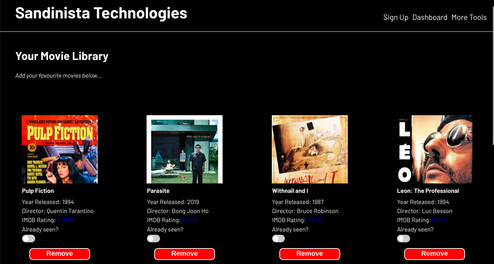

# LIBRARY

## ABOUT

This Odin project assignment outlined a task of designing a library, in which users can add, remove and edit their movies in the library. Features of this library & webpage include:

- The ability to add and edit details of their favourite movies via the toggle pop up form.
- 'Remove' buttons which delete the specifically selected movie.
- A pop up form which allows for numeric and text inputs that are required in order to submit the form.
- Once form is submitted, it displays the chosen movie with its details in a card identical to the examples on the page.
- A slider which can be inetracted with to highlight whether user has watched the respective film or not. 
- Working links.
- Text area element in which users can input their feedback.

## FOCUS TOPICS

- Intermediate level use of HTML and CSS stylings
- CSS grid layout.
- Objects, object constructors and classes.
- DOM manipulation & events.
- In particular, dynamic creation of elements via the DOM.
- Arrays.
- User inputs to instantiate objects.

## THIS PROJECT WAS CREATED WITH

-    
-    
- 
- 

## USEFUL RESOURCES 

- Stack Overflow
- Geeks for Geeks
- W3C Schools
- Mozilla Developer Network
- Javascript Documentation
  
## LINKS

[Try the assignment on The Odin Project](https://www.theodinproject.com/lessons/node-path-javascript-library)

[Have a go with the library here!](https://gangoffour199.github.io/Library/)

This markdown file was created using [dilinger.io](https://dillinger.io/)

## NOTE

*Will return to this project at a later stage to incorporate storage of the data.
